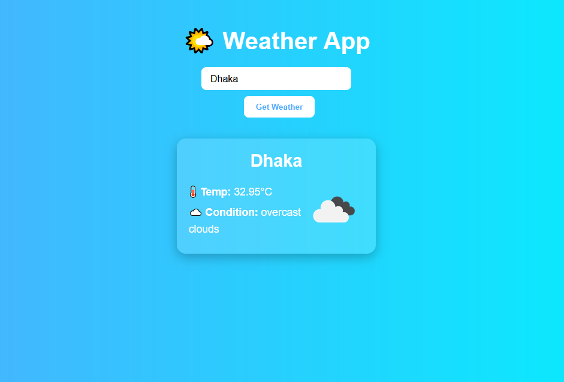

# 🌤️ Weather App

## 📖 About this Project  
The **Weather App** is a simple yet elegant application built using **HTML, CSS, and JavaScript**.  
It fetches real-time weather data from the **OpenWeather API** using the `fetch()` method and displays essential information such as:

- 🌡️ **Temperature**
- ☁️ **Weather Condition**
- 🖼️ **Weather Icon**

---

## 🚀 Features
✅ Clean and responsive design  
✅ Real-time weather updates  
✅ Loading and error handling  
✅ Decorative weather card with icon  

---

## 🛠️ Technologies Used
- 🏗️ **HTML5**  
- 🎨 **CSS3**  
- ⚡ **JavaScript (ES6)**  
- 🌍 **OpenWeather API**  

---

## 📸 Screenshot

---

## 🎯 How to Use
1. Enter your city name in the input box  
2. Click the **Get Weather** button (or press Enter)  
3. View current weather details instantly  

---

## 📂 Project Structure
weather-app/
│── index.html
│── style.css
│── script.js
│── images/
└── weather-app.png

---

## ✨ Live Demo & Source Code
🔗 [**Live Demo**](https://bipul-dev01.github.io/weather-app/)  
🔗 [**GitHub Repository**](https://github.com/bipul-dev01/weather-app)

